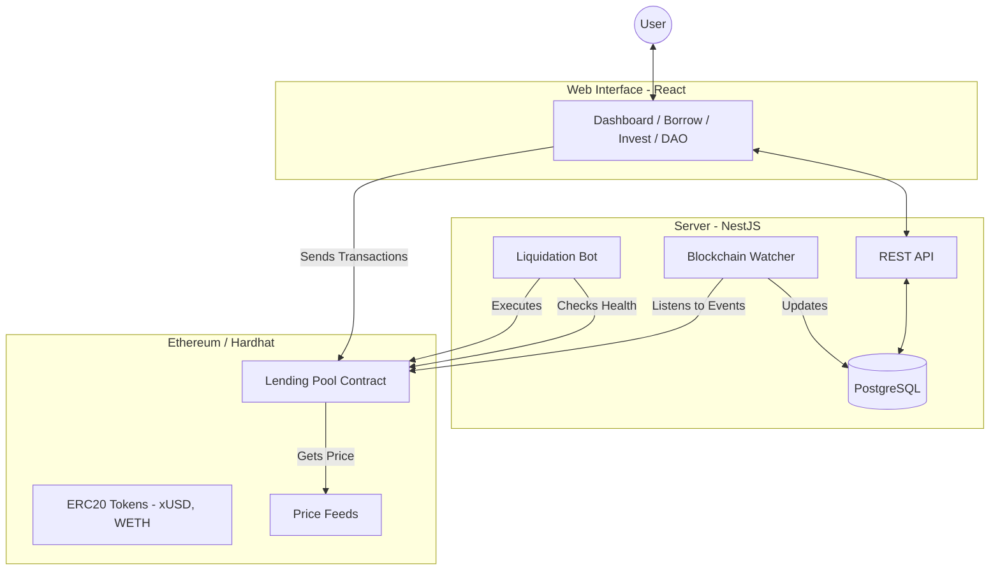

# Crypto Lend: Decentralized Lending Protocol (Detailed Explanation)

Welcome to the **Crypto Lend** project! This document explains how the platform works, its features, and the technology behind it in a way that is easy to understand, even for beginners.

## 🌟 What is Crypto Lend?

**Crypto Lend** is a Decentralized Finance (DeFi) application that allows users to:

1.  **Lend (Invest):** Deposit their cryptocurrency into a pool to earn interest.
2.  **Borrow:** Take out a loan in another cryptocurrency by providing collateral.
3.  **Governance (DAO):** Participate in the decision-making process of the platform by voting on proposals.
4.  **Liquidate:** Help maintain platform health by closing under-collateralized loans for a reward.

---

## 🛠 How It Works (The Core Mechanics)

### 1. Lending & Interest

When you deposit tokens (like xUSD) into the platform, they are added to a "Lending Pool." Other users borrow from this pool. In exchange for providing liquidity, you earn a percentage of the interest paid by borrowers.

### 2. Borrowing & Collateral

To borrow money, you must first deposit another asset as "Collateral" (security).

- **Example:** You deposit $1000 worth of ETH to borrow $700 worth of USDC.
- **Health Factor:** This is a number that shows how "safe" your loan is. If the value of your collateral drops too much compared to your loan, your health factor falls. If it goes below **1.0**, you can be liquidated.

### 3. Liquidation

If a borrower's health factor drops below 1.0, the platform allows anyone (Liquidators) to pay off part of that borrower's debt. In return, the liquidator gets the borrower's collateral at a discount. This ensures the protocol never runs out of money.

### 4. DAO (Decentralized Autonomous Organization)

The project includes a governance system. Token holders can:

- **Propose Changes:** Suggest new features or parameter changes (e.g., changing interest rates).
- **Vote:** Cast votes on these proposals. The community decides the future of the project, not a single central authority.

---

## 📊 Project Architecture

The project consists of three main parts:

1.  **Smart Contracts (Solidity):** The "Engine" that runs on the blockchain. It handles the actual money, calculations, and rules.
2.  **Backend (NestJS + PostgreSQL):** The "Brain" that watches the blockchain, stores data for fast access, and provides APIs for the frontend.
3.  **Frontend (React + Vite):** The "Face" that users interact with to manage their loans and investments.

### Graphical Representation (Mermaid)

---

## 🚀 Key Features

| Feature                   | Description                                                                          |
| :------------------------ | :----------------------------------------------------------------------------------- |
| **Multi-Asset Support**   | Supports multiple tokens like ETH, BTC, and Stablecoins (USD).                       |
| **Real-time Monitoring**  | The backend constantly watches the blockchain for deposits, borrows, and repayments. |
| **Automated Liquidation** | A built-in bot that ensures the protocol stays solvent by liquidating risky loans.   |
| **Governance Dashboard**  | A place for users to participate in the DAO and shape the project.                   |
| **Secure Logic**          | All financial math is handled by tested smart contracts.                             |

---

## 💻 Tech Stack

- **Frontend:** React, Tailwind CSS, Framer Motion (for animations), Lucide (for icons), Ethers.js (for blockchain interaction).
- **Backend:** NestJS (TypeScript), TypeORM, PostgreSQL, Docker.
- **Blockchain:** Solidity, Hardhat, OpenZeppelin.
